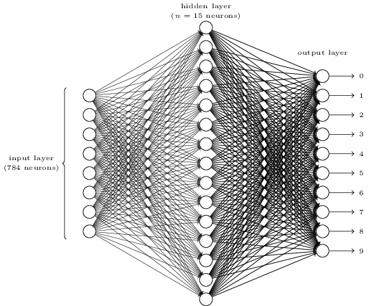
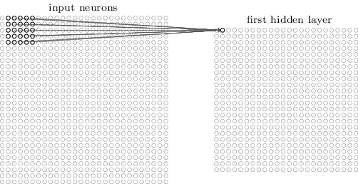
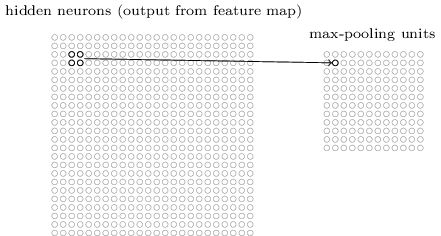

## 1. What is neural network?
A neural network is composed of many simple **neuron**s (processing units) which are hooked together to generate output based on inputs.

### 1) neuron

 There are generally two types of artificial neuron, i.e., the <u>perceptron</u> and the <u>sigmoid neuron</u>.

#### a) perceptron

**perceptron** is an algorithm for supervised learning of binary classifiers: functions that can decide whether an input belongs to one class or another. It is a type of linear classifier. (see [wiki](https://en.wikipedia.org/wiki/Perceptron)). 

A perceptron takes several binary inputs, `x1`, `x2`, ..., and produces a single binary output:

 
**b** is *bias*, a measure of how easy it is to get the perceptron to output a 1.
The weights and biases can be automatically tuned with devised **learning algorithms**. One desired property of the learning algorithm is that <u>*a small change in any weight (or bias) causes a small change in the output*</u>, such that we can gradually change the weights and biases to produce better and better output. However, perceptron is unable to provide such property as a small change may cause the output to be completely flipped, e.g. from 0 to 1. 

#### b) sigmoid neuron

The problem can be overcome by using a new type of artificial neuron called **sigmoid** neuron. Differing from perceptron, the output is not 0/1, instead it's $\sigma(w\cdot x+b)$, whose value can be any real number between 0 and 1; $\sigma$ is called the **sigmoid function**, and is defined by:

 

### 2) neural network
A number of neuron layers can compose a neural network:

 

Let's consider a simple example to recognize individual digits w/ a three-layer neural network:

 

The **input layer** contains neurons encoding the values of the input pixels (each pixel is a greyscale value between 0.0 to 1.0). Suppose that each digit image is `28x28` pixels, and so the input layer contains `784=28x28` neurons. The second layer is a **hidden layer**, whose #neurons is denoted by `n` (n=15 for the example network). The **output layer** contains 10 neurons, which are numbered from 0 through 9. The neuron has the highest activation value will report the guessed digit.

### 3) learning
Now that we have a neural network design, how can it learn to recognize digits? The first thing we need is a data set to learn from - a so-called <u>training data set</u>. What we'd like is an algorithm which lets us find weights and biases so that the output from the network approximates **y(x)** for all training inputs **x**.

To quantify how well we're achieving this goal we define a **cost function**:

 
`w` and `b` are respectively all weights and biases, `n` is the total #training inputs, `a` is the vector of outputs from the network when `x` is input, and the sum is over all training inputs `x`. `C` is called <u>mean squared error</u> (MSE). The aim of our training algorithm is to minimize the cost `C(w,b)` as a function of weights and biases.

To solve such minimization problems, we can use **gradient descent**, which starts with an initial set of parameter values and iteratively moves toward a set of parameter values that minimize the function (learn [more](https://spin.atomicobject.com/2014/06/24/gradient-descent-linear-regression/)).  

Three types of learning:

* **supervised learning**: learn to predict an output when given an input vector
  * regression: the target output is a real number or a whole vector of real numbers, e.g., stock price
  * classification: the target output is a class label
* **reinforcement learning**: learn to select an action to maximize payoff
* **unsupervised learning**: discover a good internal representation of the input

## 2. DNNs and CNNs
Traditional machine learning relies on <u>shallow</u> nets, composed of one input and one output layer, and at most one hidden layer in between. More hidden layers <u>deepen</u> the network, and enables more complex features to be learned. (learn [more](http://deeplearning4j.org/neuralnet-overview)).

**Convolutional nets** can be used to classify images, cluster them by similarity (photo search), and perform object recognition within scenes. Convolutional nets ingest and process images as tensors, and tensors are matrices of numbers with additional dimensions. ([9](http://deeplearning4j.org/convolutionalnets)). For images, width and height gives the first two dimensions. Color encoding is the depth, e.g., RGB encoding produces an image three layers deep (each layer is called a "channel"); through convolution it produces a stack of feature maps, which exists in the 4th demension. Features are just details of images, like a line or curve.

For mathematical purposes, a convolution is the integral measuing how much two functions overlap as one passes over the other. Think of a convolution as a way of mixing two functions by multiplying them. With image analysis, the static, underlying function is the input image being analyzed, and the second mobile function is known as the filter, because it picks up a signal or feature in the image. The two functions relate through multiplication.

Conv networks take multiple filters over a single image, each one picking up a different signal. Conv nets moves the filter (e.g, a vertical-line-recognizing) over the actual pixels of the image, looking for matches. Each time a match is found, it is mapped onto a feature space particular to that visual element.

A conv network receives a normal colar image as a rectangular box whose width and height are measured by #pixels along those dimensions, and whose depth is three layers deep, one for each letter in RGB. Those depth layers are referred to as **channels**. For each pixel of an image, the intensity of R/G/B will be expressed by a number, and that number will be an element in one of the three, stacked 2D matrices, which together form the image volume. These numbers are the intial, raw, sensory features being fed into the conv net, and the ConvNets purpose is to find which of those numbers are significant signals that actually help it classify images more accurately.

Rather than focus on one pixel at a time, a conv net takes in square patches of pixels and passes them through a **filter**. That filter (also called a **kernel**) is also a square matrix with equal size to the patch, and the filter is to find patterns in the pixels. We are going to take the dot product of the filter with this patch of the image channel. If the two matrices have high values in the same positions, the dot product's output will be high. Ow, it will be low. In this way, a single value - the output of the dot product - can tell us whether the pixel pattern in the underlying image matches the pixel pattern expressed by our filter.

CNNs/DNNs exploit spatially-layers local correlation by enforcing a local connectivity pattern between neurons of adjacent layers. A CNN/DNN is a sequence of multiple instances of four types of layers: a **convolutional layer** (CONV), **pooling layer**s (POOL), **local response normalization layer**s (LRN) and **classifier layer**s (CLASS), .

### 1) Convolutional layer (CONV)
<!-- Instead of connecting every input pixel to every hidden neuron, we only make connections in small, localized regions of the input image. To be more precise, each neuron in the first hidden layer will be connected to a small region of the input neurons, e.g., a 5x5 region. -->

From five to even several hundred CONV layers are commonly used in recent CNN models. Through the computation of each layer, a higher-level abstraction of the input data, called a **feature map**, is extracted to preserve essential yet unique info [6]. Generally, basic feature maps are first extracted, and then more complex feature maps will be obtained.

The feature map is obtained by repeated application of a function across small sub-regions of the entire image at layer `m`.
That region in the input image of layer `m` is called the **local receptive field** for the hidden neuron of layer `m+1`. It's a little window on the input pixels. Each connection learns a weight. And the hidden neuron learns an overall bias as well. We then slide the local receptive field across the entire input images. For each local receptive field, there is a different hidden neuron in the first hidden layer.
 

As for the above example, each hidden neuron thus has a bias and `5x5` weights connected to its local receptive field. 

<!-- The map from the input receptive field to the hidden neuron is called a **feature map**; and the weights and bias defining the feature map are often said to define a **kernel** or **filter**. More precisely, -->

A **filter** is defined by `Kx x Ky` coefficients, which are learned and form the layer synaptic weights.The coefficients themselves form the **kernel**. Each conv layer slides `Nof` such filters through the whole input layer (by steps of `sx` and `sy`), resulting in as many (`Nof`) output neurons. E.g., if we have a `28x28` input image, and `5x5` local receptive fields (i.e., filter), and move the local receptive field by one pixel at a time (`sx=1`, `sy=1`), then there will be `24x24` (`Nof`) neurons in the hidden layer, each has `25=5x5` weights and a single bias. A complete convolution layer consists of several (`Nif`) different feature maps, which can detect `Nif` different kinds of features. Hence, the kernel is usually 3D, i.e., `Kx x Ky x Nif`.

In DNNs, the kernels usually have different synaptic values for each output neuron (at each `(x,y)` position), while in CNNs, the kernels are *shared* across all neurons of the same output feature map, which greatly reduces the #parameters involved in the network (`Kx x Ky x Nif x Nof x Nx x Ny` vs. `Kx x Ky x Nif x Nof`, where `Nx` and `Ny` are the input layer dimensions).

### 2) Pooling layers (POOLs)
Pooling layers simplify the info in the output from the convolutional layer, and they are usually used immediately after convolutional layers. 

In detail, a pooling layer takes each feature map output from the convolutional layer and prepares a condensed feature map. One common procedure for pooling is *max-pooling*, where a pooling unit simply outputs the max activation in the 2x2 input region:
 
After pooling we have 12x12 neurons.

Max-pooling can be thought as a way for the network to ask whether a given feature is found anywhere in a region of the image. It then throws away the exact positional info. The intuition is that once a feature has been found, its exact location isn't as important as its rough location relative to other features. Besides max-pooling, there is another common approach known as *L2 pooling*, which takes the square root the sum of squares of the activations in the 2x2 region.

<u>Note: unlike a conv or a classifier layer, a pooling layer has no learned parameter, i.e., no synaptic weight</u>.

### 3) Local response normalization layers (LRNs) 
Local response normalization implements competition between neurons at the same location, but in different (neighbor) feature maps. LRNs are to mix multiple feature maps into one.

### 4) Classifier layers (CLASSs)
The result or the sequence of CONV, POOL and LRN layers is then fed to one or multiple classifier layers. This layer is typically fully connected to its `Ni` inputs (and it has `No` outputs), and each connection carries a learned synaptic weight. 

While the #inputs may be much lower than for other layers (due to the dimension reduction of pooling layers), they can account for a large share of all synaptic weights in the neural network due to their full connectivity. Multi-Layer perceptrons are frequently used as classifier layers, though other types of classifiers are used as well (e.g., multinomial logistic regression). The goal of these layers is naturally to correlate the different features extracted from the filtering, normalization and pooling steps and the output categories.

## 3. Research works
The main limitation is the memory bandwidth requirements of two important layer types: conv layers with private kernels (used in DNNs) and classifier layers used in both CNNs and DNNs. For these types of layers, the total #required synapses can be massive, in Ms of parameters, or even tens or hundreds thereof. For an NPU processing 16 inputs of 16 output neurons (i.e., 256 synapses) per cycle, at 0.98GHz a peak bw of 467.30 GB/s would be necessary. Off-chip memory accesses increase the total energy cost by 10x.

The fundamental issue is the memory storage (for reuse) or bandwidth requirements (for fetching) of the synapses of two types of layers: conv layers with private kernels (the most frequent case in DNNs), and classifier layers (which are usually fully connected, and thus have lots of synapses).

- synapses are always stored close to the neurons which will use them, minimizing data movement, saving both time and energy
- create an asymmetric arch where each node footprint is massively biased towards storage rather than computations
- transfer neurons values rather than synapses values because the former are orders of magnitude fewer than the latter in the aforementioned layers, requiring comparatively little bw.
- enable high internal bw by breaking down the local storage into many tiles.

a read access to a 256b wide eDRAM array at 28nm consumes 0.0192nJ (50uA, 0.9V, 606MHz), while a 256b read access to a Micron DDR3 DRAM consumes 6.18nJ at 28nm.

The complexity comes from the need to simultaneously process hundreds of filters and channels in the high-dimensional convolutions, which involve a significant amount of data movement. 

minimizes data movement energy by exploiting local data reuse of filter weights and feature map pixels, i.e., activations, in the high-dimensional convolutions, and minimizing data movement of partial sum accumulations.

CONV layers account for over 90% of the overall operations and generate a large amount of data movement. 

- Data handling. Naively reading inputs for all MACs directly from DRAM requires high bw and incurs high energy consumption; second, a significant amount of immediate data, i.e., partial sums, are generated by the parallel MACs simultaneously, which poses storage pressure and consumes additional memory R/W energy if not accessed, i.e., accumulated, immediately.

### XNOR-net
Find the best approximations of the convolutions using binary operations. Comparable accuracy, but significantly less memory and fewer FP operations.

L-layer CNN: <I, W, *>

- **Binary-Weight-Networks**: approximate all weight values with binary values; convolutions can be estimated by only addition and substraction (without multiplication).  
  `W = aB, I * W = (I?B)a`  
  optimal estimation of a binary weight filter can be simply achieved by taking the sign of weight values; optimal scaling factor is the average of absolute weight values.  
  Once the training finished, there is no need to keep the real-value weights.
- **XNOR-Networks**: both the weights and the inputs to the conv and fully connected layers are approximated with binary values. The convolutions can be estimated by XNOR and bitcounting operations.   
  `I * W = (sign(I) ? sign(W)) ! Ka`

### Deep compression
Reduces the storage and energy required to run inference on large networks so they can be deployed on mobile devices.

## References
1. Deep learning, [http://neuralnetworksanddeeplearning.com/chap6.html](http://neuralnetworksanddeeplearning.com/chap6.html)
2. DaDianNao: A machine-learning supercomputer, [http://pages.saclay.inria.fr/olivier.temam/files/eval/supercomputer.pdf](http://pages.saclay.inria.fr/olivier.temam/files/eval/supercomputer.pdf)
3. Neural networks, [http://natureofcode.com/book/chapter-10-neural-networks/](http://natureofcode.com/book/chapter-10-neural-networks/)
4. Convolutional neural networks CNNs, [http://recognize-speech.com/acoustic-model/knn/comparing-different-architectures/convolutional-neural-networks-cnns](http://recognize-speech.com/acoustic-model/knn/comparing-different-architectures/convolutional-neural-networks-cnns)
5. Convolutional Neural Networks (LeNet), [http://deeplearning.net/tutorial/lenet.html](http://deeplearning.net/tutorial/lenet.html)
6. Eyeriss: A spatial architecture for energy-efficient dataflow for convolutional neural networks, ISCA'2016
7. ISAAC: A convolutional neural network accelerator with in-situ analog arithmetic in crossbars, ISCA'2016
8. Convolutional neural network, [http://ufldl.stanford.edu/tutorial/supervised/ConvolutionalNeuralNetwork/](http://ufldl.stanford.edu/tutorial/supervised/ConvolutionalNeuralNetwork/)
9. Convolutional networks, [http://deeplearning4j.org/convolutionalnets](http://deeplearning4j.org/convolutionalnets)
10. Convolutional neural networks (CNNs/ConvNets), [https://cs231n.github.io/convolutional-networks/](https://cs231n.github.io/convolutional-networks/)

